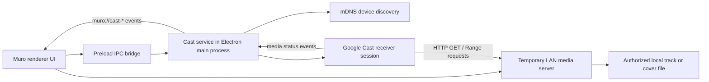

# Chromecast Feature Plan

Status: MVP implemented on `feature/chromecast-mvp`; physical-device verification pending  
Last reviewed: 2026-07-21  
Recommended first target: Windows MVP using a physical Chromecast or Google Cast speaker

## Implementation status (2026-07-21)

Milestones 1–3 are implemented with automated coverage; Milestone 0 (the
physical-device spike) could not run in the implementation environment because
no Cast device was available, so its exit criteria move to first manual test:

- `electron/cast/` holds the dependency-free CastV2 stack: `castProtocol.mjs`
  (protobuf framing over TLS, heartbeat, request correlation),
  `castDiscovery.mjs` (mDNS/DNS-SD), `castMediaServer.mjs` (tokenized LAN
  server reusing `fileProtocol.mjs` range logic), `castState.mjs`
  (status normalization, error codes, format allowlist), `castClientAdapter.mjs`
  (the only module touching the protocol), and `castService.mjs` (session
  state machine behind the `cast_*` commands).
- The renderer routes playback through one active output
  (`useAudioPlayback` + `castStore` + `castController`), advances the queue on
  the receiver's FINISHED status exactly once, and adds a Cast button with a
  device picker to the player bar.
- `npm run test:cast` covers protocol round-trips, mDNS parsing, token
  authorization/revocation, and mocked-adapter session flows.
- The direct-cast allowlist starts at MP3/FLAC/WAV/OGG/Opus; M4A/AAC and
  AIFF/ALAC report `CAST_UNSUPPORTED_FORMAT` until verified on hardware.
- Still open before this merges: the physical-device matrix below (discovery,
  firewall prompt, load/seek/volume on a real receiver), Windows packaging
  smoke, and any allowlist expansion that testing justifies.

## DLNA/UPnP output (2026-07-21, branch `feature/dlna-renderer`)

The same architecture now drives DLNA MediaRenderers, and unlike the Cast
path this one is **verified end-to-end on real hardware** (a Denon AVR-S760H
on the development network): SSDP discovery, tokenized LAN streaming,
playback, range-request seeking, and stop, via `tests/manual/dlna-spike.mjs`.

- `electron/dlna/` mirrors `electron/cast/`: SSDP discovery with
  device-description parsing (embedded renderers such as HEOS included), a
  dependency-free SOAP AVTransport/RenderingControl client with DIDL-Lite
  metadata, and a `dlna_*` session service with `DLNA_*` error codes.
- The tokenized media server is shared (`electron/lanMediaServer.mjs`) and
  answers DLNA.ORG probe headers.
- The renderer has one remote-output layer (`remoteOutputStore`/`Api`/
  `Controller`, `OutputMenu`): Cast and DLNA devices appear in the same
  picker with protocol badges, and playback routes through whichever
  protocol owns the session.
- Real-device behaviors encoded from testing: wait for the URI to register
  before `Play`, and ignore the empty transport states busy renderers report.
- `npm run test:dlna` covers the client, discovery parsing, and service flows.

## Executive summary

Chromecast support is feasible, but it is not equivalent to selecting a different local audio output. A Cast receiver does not consume the audio that Muro is already playing. It receives a media URL from Muro and then fetches and plays that URL itself.

Muro currently plays local files in the renderer through a private `muro-file://` protocol. That URL is only meaningful inside the Electron app, so a Chromecast cannot load it. The minimum viable implementation therefore needs all of the following:

1. Discover Google Cast devices on the local network.
2. Connect to a selected device and launch the Default Media Receiver.
3. Run a small, temporary HTTP media server inside Muro.
4. Expose only the selected track and artwork through secure, tokenized LAN URLs.
5. Send those URLs and track metadata to the receiver.
6. Keep remote play, pause, seek, volume, end-of-track, disconnect, and error state synchronized with Muro.

Complexity is approximately **7/10**.

- Technical spike: 2–4 engineering days.
- Usable Windows MVP: approximately 6–10 engineering days.
- Polished cross-platform feature: approximately 2–4 weeks.
- Supporting every imported format through live transcoding would add substantial work and should not be part of the first MVP.

## Recommended MVP

The first MVP should do only this:

- Discover Cast devices on the same network.
- Show a Cast button and simple device picker in the player bar.
- Connect to one device at a time.
- Cast one supported local audio file through the Default Media Receiver.
- Send title, artist, album, duration, and cover artwork.
- Support play, pause, seek, volume, next track, previous track, and disconnect.
- Keep Muro's existing local queue as the source of truth.
- Advance to the next queued track when the receiver reports that the current track finished.
- Reconnect cleanly when possible and return to a clear disconnected state when not.
- Report unsupported files instead of transcoding them.
- Work on Windows first and be exercised against at least one physical Cast device.

The MVP should not include:

- A custom or branded receiver application.
- Google Cast Developer Console registration.
- Audio groups or synchronized multi-room playback.
- Multiple simultaneous receivers.
- Screen or system-audio mirroring.
- Remote library browsing from the TV.
- Live FFmpeg transcoding.
- DRM, authentication, cloud streaming, or casting files outside the Muro library.
- Perfect session recovery after app restarts, sleep, network changes, or router changes.

Google provides a hosted Default Media Receiver for supported media. It does not require registering a custom receiver application, but its television UI cannot be customized. See [Google's Web Receiver overview](https://developers.google.com/cast/docs/web_receiver).

## Why this is more than an output selector

The current playback path is roughly:

```text
Track row / queue / player controls
              |
              v
      useAudioPlayback
              |
              v
      playbackApi.ts
              |
              v
     renderer HTMLAudioElement
              |
              v
       muro-file://local/...
```

The Cast path needs to be:



The important architectural fact is that the receiver connects back to the computer over the LAN. The `muro-file://` protocol cannot be reused directly because it is registered only inside Muro's Electron session.

## Existing Muro components that help

The repository already has several useful foundations:

- `electron/fileProtocol.mjs`
  - Maps audio and image extensions to MIME types.
  - Parses HTTP byte ranges.
  - Produces `206 Partial Content`, `Content-Range`, `Accept-Ranges`, and `HEAD` responses.
  - The generic range and MIME logic should be extracted or reused by the LAN media server.
- `tests/file-protocol-smoke.mjs`
  - Already covers the core range-serving behavior and can be expanded for the HTTP server.
- `src/utils/playbackApi.ts`
  - Provides a narrow playback command boundary.
- `src/hooks/useAudioPlayback.ts`
  - Centralizes renderer playback commands and converts runtime status into UI state.
- `src/stores/playbackStore.ts`
  - Centralizes the current track, playing state, position, volume, queue, shuffle, and repeat state.
- `electron/preload.cjs`
  - Already exposes a small IPC surface and event subscription API.
- `electron/main.mjs` and `electron/backend.mjs`
  - Provide appropriate ownership and lifecycle boundaries for a long-running Cast service and LAN server.
- `src/components/layout/PlayerBar.tsx`
  - Is the correct place for the Cast launcher and connected-device indication.

These pieces mean the feature does not require redesigning the whole application, but remote playback must become a first-class playback backend rather than a collection of special cases inside `PlayerBar`.

## Recommended technical approach

### 1. Put Cast networking in the Electron main process

Device discovery, TLS Cast connections, receiver sessions, and the LAN HTTP server should run in the Electron main process. Do not enable Node integration in the renderer and do not put raw filesystem paths or Cast sockets in React components.

Suggested modules:

```text
electron/
  cast/
    castService.mjs          # service lifecycle and public operations
    castDiscovery.mjs        # mDNS discovery and device deduplication
    castClientAdapter.mjs    # protocol/library wrapper
    castMediaServer.mjs      # tokenized HTTP track/artwork serving
    castState.mjs            # state normalization and status mapping
```

The Cast protocol dependency must live behind `castClientAdapter.mjs`. No other application code should import it directly. This makes it possible to replace an abandoned library without rewriting the UI or playback system.

### 2. Prefer the Default Media Receiver for the MVP

The Default Media Receiver is enough for normal music playback and metadata. It avoids hosting a receiver web app and avoids an application registration step.

The sender should load a buffered audio media item with:

- A tokenized HTTP track URL as the content ID.
- The correct MIME type.
- Title.
- Artist.
- Album title.
- Album artist when available.
- Duration.
- A tokenized cover-art URL when available.

Google documents play, pause, stop, seek, queue, current-time, and media-status behavior in its [Cast media API](https://developers.google.com/cast/docs/reference/web_sender/chrome.cast.media.Media).

### 3. Do not assume the official Web Sender SDK works in Electron

Google describes its Web Sender as an HTML/JavaScript app running inside Chrome and exposes it through `cast.framework` and `chrome.cast`. Electron supports only a subset of Chrome extension APIs and explicitly does not aim for full Chrome extension compatibility.

Therefore, loading Google's sender script directly in the renderer is a useful experiment but not a dependable architecture. The recommended spike is a main-process CastV2 adapter plus mDNS discovery.

This is an inference from the supported-platform documentation, not an explicit Google or Electron statement that all Cast APIs fail in every Electron build:

- [Google Web Sender integration guide](https://developers.google.com/cast/docs/web_sender/integrate)
- [Electron Chrome extension support and limitations](https://www.electronjs.org/docs/latest/api/extensions/)

### 4. Treat third-party CastV2 code as a replaceable risk

The commonly referenced [`castv2-client`](https://github.com/thibauts/node-castv2-client) project can launch the Default Media Receiver and control media, but its visible commit history stops in January 2017 and it has no published GitHub releases. It must not be spread throughout the application.

Before choosing a dependency, the implementing agent should:

1. Search for a currently maintained fork or compatible implementation.
2. Check its latest release and commit dates.
3. Check Electron/Node compatibility and whether it requires native modules.
4. Run `npm audit` after installation.
5. Verify discovery, connection, load, status, seek, and disconnect on a physical device.
6. Wrap the result behind `castClientAdapter.mjs`.

If no acceptable implementation exists, stop after the technical spike and report the dependency risk instead of embedding old protocol code deeply into Muro.

## LAN media server design

The media server is required because the receiver must fetch the local file from the computer.

### Server behavior

- Start it only when discovery or a Cast session requires it.
- Bind to an ephemeral port rather than a fixed port.
- Determine an IPv4 LAN address reachable by the selected Cast device.
- Do not advertise `localhost` or `127.0.0.1` to the receiver.
- Support `GET` and `HEAD`.
- Support standard single byte-range requests.
- Return `206`, `416`, `Content-Range`, `Accept-Ranges`, `Content-Length`, and the correct content type.
- Stream from disk; do not load complete audio files into memory.
- Serve cover artwork through the same authorization system.
- Shut down when the application exits. It may remain alive while a Cast session is active.
- Emit actionable errors for bind failures, inaccessible interfaces, and interrupted streams.

### Security requirements

The server must never accept a filesystem path from the URL.

Use an in-memory authorization map such as:

```text
random session token + random media token -> exact approved absolute file path
```

Example URLs:

```text
http://192.168.1.25:49152/media/<session-token>/<media-token>
http://192.168.1.25:49152/artwork/<session-token>/<artwork-token>
```

Required protections:

- Generate tokens with a cryptographically secure random generator.
- Allow only exact entries currently present in the authorization map.
- Never decode an arbitrary path from the request URL.
- Expire tokens when the session ends or after a short inactivity period.
- Use `Cache-Control: no-store` for MVP simplicity.
- Reject unsupported methods.
- Avoid permissive directory roots and directory listing.
- Log only token IDs or track IDs, never full tokenized URLs at normal log levels.
- Do not expose the service beyond the local network unnecessarily.

Whether the receiver requires any specific CORS response should be confirmed on the physical device. Google notes that media loading problems can be CORS-related in its [supported media documentation](https://developers.google.com/cast/docs/media).

### Windows Firewall

The first incoming receiver connection may trigger a Windows Firewall prompt. The MVP must:

- Explain why local-network access is needed before or alongside the operating-system prompt.
- Detect and report a timeout rather than leaving the UI in “Connecting”.
- Avoid automatically adding firewall rules through elevated commands.
- Provide a retry action after the user allows access.

## Discovery and connection model

Cast devices are normally discovered through mDNS/DNS-SD on `_googlecast._tcp.local`.

The discovery layer should:

- Start and stop explicitly.
- Deduplicate devices by stable device ID, not display name.
- Track device name, host, port, capabilities, and last-seen time.
- Remove or mark stale devices after a reasonable timeout.
- Avoid blocking application startup when multicast is unavailable.
- Report “No devices found” separately from “Discovery failed”.
- Handle IPv4 first for the Windows MVP; document IPv6 as later work.

The connection layer should expose a normalized state machine:

```text
idle
  -> discovering
  -> connecting
  -> connected
  -> loading
  -> playing / paused / buffering
  -> disconnecting
  -> idle

Any state may transition to error, then back to idle or connecting after retry.
```

Avoid representing the session with several unrelated booleans.

## Suggested IPC contract

Reuse the existing `muro:invoke` and `muro:event` bridge rather than adding direct renderer access to Node APIs.

Possible commands:

```text
cast_start_discovery
cast_stop_discovery
cast_get_devices
cast_connect
cast_disconnect
cast_load_track
cast_play
cast_pause
cast_seek
cast_set_volume
cast_get_state
```

Possible events:

```text
muro://cast-devices
muro://cast-state
muro://cast-media-status
muro://cast-error
```

Every command should return a serializable result. Errors crossing IPC should be converted to stable codes and user-safe messages, for example:

```text
CAST_DEVICE_NOT_FOUND
CAST_CONNECT_TIMEOUT
CAST_LOAD_FAILED
CAST_UNSUPPORTED_FORMAT
CAST_MEDIA_SERVER_UNREACHABLE
CAST_SESSION_ENDED
```

## Renderer state and playback integration

### Add a separate Cast session store

A `useCastStore` can hold:

- Available devices.
- Discovery state.
- Selected device.
- Session state.
- Remote player state.
- Last error.

Do not duplicate the main queue in this store.

### Make playback output-aware

The playback layer should have one active output:

```ts
type PlaybackOutput =
  | { kind: "local" }
  | { kind: "cast"; deviceId: string; deviceName: string };
```

`useAudioPlayback` or a new higher-level `usePlaybackController` should route commands to the local HTML audio runtime or Cast service. `PlayerBar` should not decide which backend receives each command.

Only one output should play at a time.

Recommended switching behavior:

- When connecting while a local track is playing:
  1. Capture current track and position.
  2. Pause local playback.
  3. Connect and load the same track at approximately that position.
  4. If Cast load fails, keep local playback paused and offer “Resume here”; do not unexpectedly play both outputs.
- When disconnecting:
  1. Capture the last remote position.
  2. Stop or leave the receiver according to the explicit user action.
  3. Switch output to local.
  4. Keep local playback paused at the captured position for MVP safety.
  5. Let the user press Play to resume locally.

### Queue ownership

For the MVP, keep queue advancement in Muro:

- Cast only the current track.
- When the receiver reports `IDLE` with a finished/end reason, invoke the existing next-track logic.
- Load the next track as a new receiver media item.
- Keep shuffle and repeat decisions in the existing playback controller.

Do not implement a receiver-managed queue until single-track status and reconnection behavior are reliable.

## UI recommendation

Place the Cast button in `PlayerBar`, near output/volume controls. This matches the feature's role as an output destination and keeps it available from every library view.

### Cast button states

- Hidden or muted when Cast support is unavailable.
- Normal when devices may be discoverable.
- Spinner while discovering or connecting.
- Accent color while connected.
- Error indicator only when user action is required.
- Tooltip should include the connected device name.

### Device picker

Use a small anchored popover with:

- Heading: “Cast to”.
- Scanning indicator.
- Device rows with name and connection state.
- “No devices found” explanation and retry button.
- Connected device row with a check mark.
- Disconnect action.
- Last error with a concise retry action.

Do not show raw IP addresses unless a developer diagnostics mode is enabled.

### Player behavior while casting

- The existing play, pause, seek, next, previous, repeat, queue, and volume UI remains visible.
- Position and duration come from remote status while casting.
- The output label shows the selected Cast device.
- Local waveform generation can remain local and independent.
- Editing, analysis, browsing, and queue reordering should continue normally.

## Format support policy

Google currently documents support for MP3, MP4, OGG, WAV, WebM, FLAC, AAC variants, Opus, and Vorbis across Cast receivers, with device-specific differences. See [Supported Media for Google Cast](https://developers.google.com/cast/docs/media).

Muro imports formats that may not work consistently on Cast devices, especially:

- AIFF.
- ALAC.
- Some AAC container/profile combinations.
- Files with incorrect extensions or MIME metadata.
- Very high bitrate or unusual sample-rate/channel configurations.

MVP policy:

1. Maintain an explicit direct-cast allowlist based on extension and MIME type.
2. Start conservatively with MP3 and one or two formats confirmed on the test device.
3. Expand the allowlist only after physical-device tests.
4. When unsupported, show “This format cannot be cast yet” and keep local playback available.
5. Do not silently transcode and do not send a URL that is expected to fail.

Future transcoding could use FFmpeg to produce a temporary AAC or MP3 stream, but that adds:

- A large packaged binary.
- Licensing and redistribution review.
- CPU use and startup latency.
- Seek and duration complexity.
- Temporary file or live-stream lifecycle management.
- More failure modes during sleep and network interruption.

Treat transcoding as a separate feature after direct playback is stable.

## Implementation milestones

### Milestone 0: physical-device technical spike

Goal: prove the risky parts before changing production playback code.

- Create an isolated script under `scripts/` or `tests/manual/`.
- Discover one Chromecast.
- Start a temporary range-capable HTTP server.
- Serve a known MP3 fixture from the computer's LAN address.
- Launch the Default Media Receiver.
- Load, play, pause, seek, query status, and disconnect.
- Record library choice, device model, operating system, firewall behavior, and failure logs.

Exit criteria:

- A physical device plays a local MP3.
- Seeking works through an HTTP range request.
- The receiver can fetch the media URL after the firewall prompt is resolved.
- The chosen protocol dependency works in the packaged Electron/Node version.

If this milestone fails, do not continue into UI implementation.

### Milestone 1: production services and tests

- Add the Cast client adapter.
- Add discovery and connection state management.
- Add the tokenized media server.
- Extract reusable MIME and range behavior from `fileProtocol.mjs` without breaking local playback.
- Add service lifecycle cleanup to application shutdown.
- Add mockable interfaces for discovery, receiver client, and media server.

### Milestone 2: IPC and playback backend

- Add commands and events through the existing bridge.
- Add Cast state types.
- Add renderer subscriptions.
- Make playback output-aware.
- Route play, pause, seek, volume, and track load based on active output.
- Add sender-managed end-of-track queue advancement.

### Milestone 3: player-bar UI

- Add Cast button and device picker.
- Add connecting, connected, unsupported, and error states.
- Show device name as the active output.
- Add disconnect and retry behavior.
- Preserve keyboard accessibility and existing player layout at minimum width.

### Milestone 4: hardening

- Test router/network changes and device disappearance.
- Test the Windows Firewall denied, accepted, and later-enabled paths.
- Test app shutdown during streaming.
- Test tracks being deleted or moved while authorized.
- Test cover art missing or unreadable.
- Test repeated connect/disconnect cycles.
- Test queue completion, shuffle, and repeat.
- Package and test the installer, not only the development build.

## Testing strategy

### Automated unit tests

- Device deduplication and stale-device expiry.
- Cast state-machine transitions.
- Mapping receiver status to Muro playback state.
- Media token creation, lookup, expiry, and revocation.
- Rejection of directory traversal and unknown tokens.
- MIME type mapping.
- `GET`, `HEAD`, valid range, suffix range, open-ended range, and invalid range behavior.
- Queue advancement on receiver-finished events.
- No queue advancement on user stop, disconnect, or load error.
- Local-to-Cast and Cast-to-local transition rules.

### Automated integration tests

Use a mocked Cast client adapter in CI. Do not require a physical Chromecast for normal test runs.

- Main-process command creates predictable service calls.
- Cast events cross the preload bridge.
- Renderer store updates from status events.
- Player controls route to the remote backend while casting.
- Local HTML audio does not play simultaneously.
- The LAN server can stream a fixture with range requests.
- Expired media URLs return a safe error.

### Renderer smoke coverage

- Cast button renders in the player bar.
- Picker opens and closes correctly.
- Mock devices appear and can be selected.
- Connecting and connected states are visible.
- Remote play/pause/seek/volume calls are dispatched.
- Disconnect returns the UI to local output.
- Unsupported media produces an actionable state.

### Required manual matrix

At minimum, record results for:

- One Chromecast/Google TV/Nest device model.
- Windows with firewall access accepted.
- Windows with firewall access denied.
- Ethernet computer to Wi-Fi receiver if available.
- Wi-Fi computer to Wi-Fi receiver.
- MP3.
- FLAC or M4A/AAC after MP3 succeeds.
- Seek near the start, middle, and end.
- Pause for several minutes and resume.
- Queue transition to the next track.
- Device powered off during playback.
- App closed during playback.

## MVP acceptance criteria

The MVP is complete only when all of the following are true:

- The app discovers a supported receiver without blocking startup.
- The user can connect and disconnect from the player bar.
- A supported local MP3 plays on a physical receiver.
- Local playback is paused before remote playback begins.
- Play, pause, seek, volume, next, and previous affect the receiver.
- Position, duration, and playing state reflect remote status.
- The next queued track loads after natural completion.
- Tokenized media URLs cannot be used to access arbitrary files.
- Byte-range requests work and do not buffer entire tracks in memory.
- No unsupported raw filesystem path crosses into the renderer UI.
- Firewall denial and receiver disappearance result in clear, recoverable errors.
- The normal production build, renderer smoke test, server tests, and Windows packaging pass.
- Direct local playback still behaves exactly as before when no Cast session exists.

## Known risks and decisions

| Risk | Impact | MVP decision |
|---|---|---|
| Official Web Sender may not be available in Electron | High | Use a main-process adapter; verify in spike |
| Common Node CastV2 package is old | High | Isolate dependency and assess maintained alternatives |
| Windows Firewall blocks receiver requests | High | Detect timeout, explain, retry; no elevated rule changes |
| Multiple network interfaces choose the wrong LAN IP | High | Select based on receiver route when possible and test VPNs |
| AIFF/ALAC or unusual codecs fail | Medium | Conservative allowlist; no MVP transcoding |
| Device disconnects or sleeps | Medium | Clear state and recoverable reconnect action |
| Receiver and sender state drift | Medium | Treat receiver status as authoritative while casting |
| Queue semantics become duplicated | Medium | Keep queue in Muro and cast one track at a time |
| Media URL exposes local files | High | Random tokens mapped to exact approved paths only |
| Cast device uses a different network/VLAN | Medium | Explain same-network requirement; do not bypass isolation |

## Suggested branch and commit sequence

Create a separate branch from the intended clean base, for example:

```text
codex/chromecast-mvp
```

Keep commits small enough to revert independently:

```text
test: add Chromecast physical-device spike
feat: add secure LAN media server
feat: add Cast discovery and session service
feat: expose Cast commands through desktop bridge
feat: add remote playback backend
feat: add Cast device picker to player bar
test: cover Cast playback and recovery states
```

Do not mix unrelated album, navigation, analysis, or metadata changes into the MVP branch.

## Handoff prompt for another implementation agent

The following can be copied into another task:

> Implement the Windows-first Chromecast MVP described in `CHROMECAST_FEATURE.md` on a separate branch. Start with Milestone 0 only: prove physical-device discovery, secure LAN streaming of one MP3 with byte-range support, Default Media Receiver playback, pause, seek, status, and disconnect. Do not modify production playback or build UI until the spike exit criteria pass. Keep all third-party Cast protocol code behind an adapter. Do not add transcoding, custom receivers, audio groups, or arbitrary filesystem serving. Preserve the sandboxed Electron renderer and existing local playback. Add automated tests for every reusable server or state component and report the physical device and firewall results.

## Primary references

- [Google Cast overview](https://developers.google.com/cast/docs/overview)
- [Integrate the Google Cast Web Sender SDK](https://developers.google.com/cast/docs/web_sender/integrate)
- [Google Cast Web Receiver overview](https://developers.google.com/cast/docs/web_receiver)
- [Google Cast supported media](https://developers.google.com/cast/docs/media)
- [Google Cast audio-device guidance](https://developers.google.com/cast/docs/audio)
- [Google Cast media playback messages](https://developers.google.com/cast/docs/media/messages)
- [Electron Chrome extension support](https://www.electronjs.org/docs/latest/api/extensions/)
- [`castv2-client` reference implementation and maintenance history](https://github.com/thibauts/node-castv2-client)

